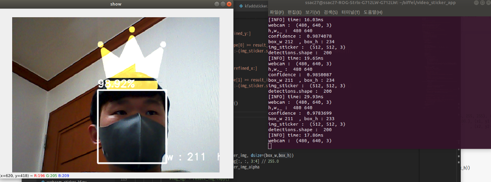
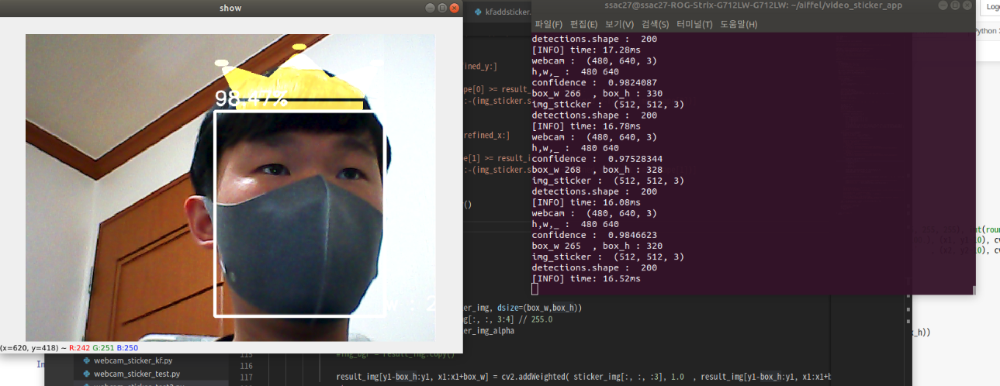

## 얼굴인식 이미지 스티커  
dlib+hog를 시작으로 OpenCV_dnn을 사용한 얼굴인식 후 이미지 스티커를 붙이는 과정을 진행해 보겠습니다.   


### 예외상황 & 문제해결 과정  
이미지 스티커를 실시간으로 붙였을때 발생하는 예외상황과 문제해결 과정을 기재합니다.      

<br>

###  스티커 Out Bound 예외처리

#### 1. 발생하는 예외 상황  

1. 얼굴이 카메라 왼쪽 경계를 벗어나서 detection 되는 경우 예외가 발생합니다.   [화면 종료 ]


2. 얼굴 detection이 되면서 sticker와 영상을 합성할 때 빠르게 얼굴을 움직여서 얼굴은 인식되는데 스티커가 못 붙이게 만들면 예외가 발생합니다.  


> 모든 예외 문구는 아래와 같습니다.   [img 합성할때 오류가 발생]

``` python
Traceback (most recent call last):
  File "webcam_sticker.py", line 44, in <module>
    main()
  File "webcam_sticker.py", line 32, in main
    img_result = img2sticker(img, img_sticker.copy(), detector_hog, landmark_predictor)   
  File "/home/ssac27/aiffel/video_sticker_app/newaddsticker.py", line 42, in img2sticker
    cv2.addWeighted(sticker_area, 1.0, img_sticker, 0.7, 0)
cv2.error: OpenCV(4.5.1) /tmp/pip-req-build-hj027r8z/opencv/modules/core/src/arithm.cpp:666: error: (-209:Sizes of input arguments do not match) The operation is neither 'array op array' (where arrays have the same size and the same number of channels), nor 'array op scalar', nor 'scalar op array' in function 'arithm_op'

```    

---

#### 2. 문제가 어디에서 발생하는지 코드에서 확인해 봅시다.   
카메라에 얼굴이 인식될때 코 부분이 왼쪽 화면 경계로 넘어가거나 근처에 다가갈때 x의 값이 0에 가깝게 되고 그때의 dlib가 인식한 rect의 w[너비] 값의 반보다 작게되면  reifined_x가 음수가되어 인덱스 범위에 오류가 발생한다.   

- dlib가 인식한 너비의 절반보다 x[코 위치] 부분의 좌표값이 작은 경우 오류가 발생한다. <br><br>
  - img_bgr[..., refined_x:...] 에서 numpy array의 음수 index에 접근하게 되므로 예외가 발생  <br>
  - **newaddsticker.py**의 img2sticker 메소드에서 아래 부분을 수정해야 한다.

---

#### 3. Out bound 오류(경계 밖으로 대상이 나가서 생기는 오류) 해결
아래의 코드를 이용해 **newaddsticker.py** 파일을 수정합니다.   

``` python

    if refined_x < 0:
        img_sticker = img_sticker[:, -refined_x:]
        refined_x = 0
    elif refined_x + img_sticker.shape[1] >= img_orig.shape[1]:
        img_sticker = img_sticker[:, :-(img_sticker.shape[1]+refined_x-img_orig.shape[1])]
        
```

---

#### 4. 다른 예외는 어떤 것들이 있는지 정의   
프로그램의 강제 종료가 아닌 예외상황으로는 다음과 같은 경우가 있습니다.   


#### 예외 상황 :   
- **고개의 각도가 똑바르지 않은 경우**   
ex) 왼쪽 아래나 오른쪽 위 등을 바라볼 때도 스티커의 모양이 일정하게 붙어 있어서 스티커의 반은 얼굴 위 나머지 반은 공중에 떠 있는 상태인 것 


- **화면과 거리가 매우 가까운 경우** 얼굴을 제대로 인식하지 못해서 이미지를 붙이지 못한다.
  - **화면과 거리거 먼 경우**에도 위와 동일하다. 

---


###  스티커앱 분석 - 거리, 인원 수, 각도, 시계열 안정성
카메라와 사람의 거리 및 각도, 카메라 상에 존재하는 사람의 수, 시계열 안정성에 따른 다양한 예외상황이 있습니다.     
위와 같은 다양한 예외상항을 찾아봅시다.  

#### 멀어지는 경우에 왜 스티커앱이 동작하지 않는지 분석

스티커 앱의 중요 단계는 다음과 같습니다.  [**detection**, **landmark**, **blending**]    <br>

- 얼굴을 인식[**detection**]하고 얼굴의 [**landmark**]를 찾은 후 이미지 스티커와 원본 이미지를 섞는 [**blending**]  단계 중에 dlib detection에서 문제가 발생합니다.   

- 카메라에서 사람이 멀어지는 경우 **detector_hog** 단계에서 bbox 가 출력되지 않습니다.

``` python
    # preprocess
    img_rgb = cv2.cvtColor(img_orig, cv2.COLOR_BGR2RGB)
    # detector
    img_rgb_vga = cv2.resize(img_rgb, (640, 360))
    dlib_rects = detector_hog(img_rgb_vga, 0)
    if len(dlib_rects) < 1:
        return img_orig
```

---

**2. detector_hog의 문제를 해결하기 위해, 이미지 피라미드를 조절하여 성능을 향상시키는 간단한 방법이 있습니다. 이 방법을 활용하여 img2sticker 메소드를 간단히 고쳐 봅시다.**

아래의 코드를 사용해서 img pyramid 수를 조정하면 됩니다.   

``` python
def img2sticker(img_orig, img_sticker, detector_hog, landmark_predictor):
    # preprocess
    img_rgb = cv2.cvtColor(img_orig, cv2.COLOR_BGR2RGB)

    # detector
    img_rgb_vga = cv2.resize(img_rgb, (640, 360))
    dlib_rects = detector_hog(img_rgb_vga, 1) # <- 이미지 피라미드 수 변경
    if len(dlib_rects) < 1:
        return img_orig

    # landmark
    list_landmarks = []
    for dlib_rect in dlib_rects:
        points = landmark_predictor(img_rgb_vga, dlib_rect)
        list_points = list(map(lambda p: (p.x, p.y), points.parts()))
        list_landmarks.append(list_points)
```

이미지 파라미드를 변경하고 실행하면 문제가 발생할 것입니다.  

**webcam_sticker.py** 를 다시한번 실행하여 스티커앱이 어떻게 동작하는지 살펴보고 문제가 생기는 경우 어떤 문제가 발생하는지 알아봅시다.    

---

#### 3. 위에서 새롭게 시도한 방법의 문제점은 무엇인가요?

- 속도가 현저히 느려집니다. 
   - 기존 30ms/frame 에서 120ms/frame 으로 약 4배 느려짐 → 실시간 구동이 불가능 합니다.
   
---

#### 4. 실행시간을 만족할 수 있는 방법을 찾아봅시다.   

- hog 학습 단계에서 다양한 각도에 대한 hog 특징을 모두 추출해서 일반화 하기 어렵기 때문에 딥러닝 기반 디텍터를 사용하는 방법이 더 좋은 성능을 보입니다.   

- dlib + hog 디텍트 방식은 현재 잘 사용하지 않는 방식으로 deep learning을 사용하는 얼굴 디텍트 방식으로 2가지를 소개하겠습니다.    

1. **opencv + Haar(Haar Cascades)**   
Haar 특징기반 다단계 분류자(Feature-based Cascade Classifiers)를 이용한 물체 검출   
- **인테그랄(Integral)** 이미지를 사용해서픽셀의 합의 계산을 단순화 시켜 줍니다. 
   - 알고리즘 속도를 매우 빠르게 개선시켜 줍니다.
- **다단계 개념 사용** : 윈도우에 대한 모든 특징을 적용하는 대신, 분류자의 다른 단계로 특징을 묶고 하나씩 하나씩 적용 [윈도우가 얼굴 영역이 아닌지를 검사하는 방법]   


#### opencv + Haar(Haar Cascades) 코드  :    
<details>
    
    
``` python
import cv2, time

# load model
# haarcascade 모델을 불러와서 사용한다.   
detector = cv2.CascadeClassifier('models/haarcascade_frontalface_default.xml')

# initialize video source, default 0 (webcam)
cap = cv2.VideoCapture(0)

fourcc = cv2.VideoWriter_fourcc('m', 'p', '4', 'v')


frame_count, tt = 0, 0

while cap.isOpened():
  ret, img = cap.read()
  if not ret:
    break

  frame_count += 1

  start_time = time.time()

  # prepare input
  result_img = img.copy()
  gray = cv2.cvtColor(result_img, cv2.COLOR_BGR2GRAY)

  # inference, find faces
  # 인테그랄(Integral) 이미지 사용을 위해 gray scale 이미지로 변환한다.  
  detections = detector.detectMultiScale(gray)

  # postprocessing
  # detection한 결과 top-left[왼쪽 위] 좌표와 rect의 너비[w], 높이[h] 값이 return된다.
  # 위의 값으로 bottom-right[오른쪽 아래] 좌표를 유추해낼 수 있다.  
  for (x1, y1, w, h) in detections:
    x2 = x1 + w
    y2 = y1 + h

    # draw rects
    cv2.rectangle(result_img, (x1, y1), (x2, y2), (255, 255, 255), 2, cv2.LINE_AA)

  # inference time
  # fps(frame pre second)별 정확도 확인
  tt += time.time() - start_time
  fps = frame_count / tt
  cv2.putText(result_img, '(haar): %.2f' % (fps), (10, 30), cv2.FONT_HERSHEY_SIMPLEX, 1, (255, 255, 255), 2, cv2.LINE_AA)

  # visualize
  cv2.imshow('result', result_img)
  # q 누를시 종료
  if cv2.waitKey(1) == ord('q'):
    break


cap.release()
out.release()
cv2.destroyAllWindows()

```

</details>

2. **opencv + dnn(deep neural network)**   
pencv dnn 모듈은 directed graph 이고, 이미 만들어진 네트워크에서 순방향 실행을 위한 용도로 설계되었다.  <br>
   즉, 모델학습을 하지 않고 학습된 모델을 불러와서 사용한다.


- 딥러닝 학습은 caffe, tensorflow등의 다른 딥러닝 프레임워크에서 진행한 후 학습된 모델을 불러와 실행할 떄는 dnn 모듈을 사용한다.    


- dnn module는 Python 뿐만 아니라 c/c++ 환경에서도 동작할 수 있기에 프로그램 이식성이 높다


#### opencv + dnn(deep neural network) 코드  :    
<details>

``` python

import cv2, time

# load model
model_path = 'models/opencv_face_detector_uint8.pb'
config_path = 'models/opencv_face_detector.pbtxt'
net = cv2.dnn.readNetFromTensorflow(model_path, config_path)

conf_threshold = 0.7

# initialize video source, default 0 (webcam)
cap = cv2.VideoCapture(0)

fourcc = cv2.VideoWriter_fourcc('m', 'p', '4', 'v')


frame_count, tt = 0, 0

while cap.isOpened():
  ret, img = cap.read()
  if not ret:
    break

  frame_count += 1

  start_time = time.time()

  # prepare input
  result_img = img.copy()
  h, w, _ = result_img.shape
  blob = cv2.dnn.blobFromImage(result_img, 1.0, (640, 360), [104, 117, 123], False, False)
  net.setInput(blob)

  # inference, find faces
  detections = net.forward()

  # postprocessing
    # (x1,y1) : 얼굴인식한 rect에서의 왼쪽 위 좌표
    # (x2,y2) : 얼굴인식한 rect에서의 오른쪽 아래 좌표
  for i in range(detections.shape[2]):
    confidence = detections[0, 0, i, 2]
    # conf_threshold = 0.7   : 0.7 확률 초과인 결과만 얼굴로 판단
    if confidence > conf_threshold:
      x1 = int(detections[0, 0, i, 3] * w)
      y1 = int(detections[0, 0, i, 4] * h)
      x2 = int(detections[0, 0, i, 5] * w)
      y2 = int(detections[0, 0, i, 6] * h)

      # draw rects
      # top-left corner (x1, y1) , bottom-right corner (x2, y2)  box 그리기
      cv2.rectangle(result_img, (x1, y1), (x2, y2), (255, 255, 255), int(round(h/150)), cv2.LINE_AA)
      # 위의 결과를 확률로 표시 
      cv2.putText(result_img, '%.2f%%' % (confidence * 100.), (x1, y1-10), cv2.FONT_HERSHEY_SIMPLEX, 1, (255, 255, 255), 2, cv2.LINE_AA)

  # inference time
  tt += time.time() - start_time
  fps = frame_count / tt
  cv2.putText(result_img, 'FPS(dnn): %.2f' % (fps), (10, 30), cv2.FONT_HERSHEY_SIMPLEX, 1, (255, 255, 255), 2, cv2.LINE_AA)

  # visualize
  cv2.imshow('result', result_img)
    # q 누를시 종료
  if cv2.waitKey(1) == ord('q'):
    break


cap.release()
out.release()
cv2.destroyAllWindows()

```
</details>

#### 5. 인원 수, 각도 등 각 문제에 대해서 1 - 4번을 반복

---

###  칼만 필터 적용하기
칼만 필터를 적용해 스티커의 움직임을 좀 더 부드럽게 만들어 줍니다.   

#### 1. 카메라 앞에서 가만히 있을 때 스티커의 움직임을 관찰해 주세요. 어떤 문제가 발생하나요?
가만히 있어도 스티커의 크리가 일정하게 유지되지 않고, 떨리는 것처럼 보이는 현상이 발생합니다.


#### 2. 이론 강의에서 배운 칼만 필터를 적용해서 스티커 움직임을 안정화시켜 주세요.

동영상에 칼만필터를 적용한 결과 더 부드러운 스티커 이미지를 보입니다.   


**dlib + hog가 아닌 openCV_dnn을 적용해서 사용**   

- 얼굴을 인식하는 bounding box의 (w,h) 크기 비례해서 왕관 이미지를 띄워서 얼굴의 각도에 따른 얼굴의 크기에 반응을 한다.  

- 거리에 따라서 box의 크기가 변동하기에 왕관의 크기도 변동된다.  


> 좀 더 자연스러운 이미지 출력 + dlib_hog보다 빠른 속도

### 정상 거리  



이미지의 가로, 세로 비율이 크게 차이 나지 않은 모습을 보이고 있다.  

---

### 카메라와 얼굴 근접 


화면에 차지하는 얼굴 크기에 비례 + 화면의 경계 밖으로 빠져나가지 않도록 이미지 비율 조정

